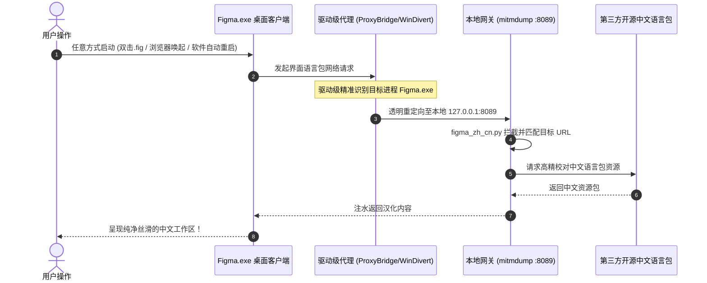

> 本项目基于 [Mitmproxy](https://mitmproxy.org/) 实现。主要功能为：通过本地代理拦截 Figma 客户端的语言包请求并重定向至第三方中文语言包，配合透明代理工具（如 ProxyBridge / Proxifier）实现对 Figma 的完美、零延迟汉化。

---

## 📌 痛点剖析：为什么传统汉化方式频频崩溃？

UI/UX 设计师和前端开发者几乎每天都离不开 Figma。然而 Figma 官方桌面客户端长期未提供官方简体中文语言选项。回顾市面上常见的第三方汉化手段，几乎都逃不开以下几大顽疾：

1. **快捷方式传参劫持（如 `--lang=zh-CN` 或注入加载脚本）**：
   - 只要你通过桌面快捷方式打开，看似一切正常；
   - 但一旦你在文件管理器中**双击 `.fig` 文件**、在浏览器中点击 `figma://` 协议链接唤起，或者在软件内部点击**“立即更新并重启”**，系统调用的根本不是你修改过的快捷方式！启动参数瞬间丢失，界面当场退回全英文；
2. **客户端硬替换补丁**：
   - 直接暴力修改 Electron 的核心包文件；
   - 一旦 Figma 进行静默增量升级，被修改的文件就会被官方远端包无情覆盖，导致你必须反复重新打补丁；
3. **C 盘无节制膨胀**：
   - Figma 采用 Squirrel 安装机制，每次后台静默下载新版本后，都会在 `%LocalAppData%\Figma\` 下残留历史版本的 `app-xxx` 完整文件夹，动辄吞噬数个 G 的系统盘空间。

为了彻底终结“每次升级就失效、不同入口换着崩”的恶性循环，我换了一个思考维度：**为什么非要在本地文件上动刀？既然语言包是通过网络请求获取的，为什么不在网络层直接降维打击？**

---

## 🚀 核心架构：网络层降维打击

经过多轮迭代，本项目彻底抛弃了“劫持并修改系统快捷方式参数”的传统做法，改用 **“透明代理 / 进程级底层代理”** 方案：



无论你是通过开始菜单启动、双击 `.fig` 文件直接唤醒客户端，还是在软件内部点击“立即更新重启”，Figma 的网络流量都会在底层驱动被无缝捕获并重定向至本地网关。这从根本上彻底根除了 Figma 更新后参数丢失、汉化失效的顽疾。

---

## 💡 启动器设计：零内存驻留与自动瘦身

为了实现真正省心的体验，本项目定制了专用的启动器 `FigmaCn.vbs`：

1. **后台静默拉起**：在后台无黑框、静默拉起 `mitmdump`（监听在 `8089` 端口，并挂载汉化拦截脚本 `figma_zh_cn.py`）；
2. **自动巡检与磁盘瘦身**：启动时自动巡检本地 Figma 路径，自动清理旧版本产生的垃圾遗留文件夹（如历史 `app-xxx` 废弃包），有效节省 C 盘空间；
3. **零内存常驻**：清理并拉起后台服务后，脚本自身在几毫秒内**立即退出销毁，实现 0 额外内存驻留**。

---

## 📦 快速食用指南

你可以选择直接下载打包好的**“懒人包”**（内含预先准备好的 `mitmdump.exe`，无需配置任何 Python 环境），或者自行前往 [Mitmproxy 官网](https://mitmproxy.org/) 下载安装包提取 `mitmdump.exe` 放入根目录。

只要确保根目录下有 `mitmdump.exe`，按以下三步即可开箱即用：

---

### 第一步：初次使用，生成并安装根证书 (仅需一次)

为了能够正确解密并拦截 HTTPS 语言包请求，需要生成并信任本地证书：

1. 双击运行目录下的 `mitmdump.exe`，等待命令行生成证书后按 <kbd>Ctrl</kbd> + <kbd>C</kbd> 退出；
2. 打开资源管理器，进入 `C:\Users\你的用户名\.mitmproxy\` 文件夹；
3. 找到并双击 **`mitmproxy-ca-cert.p12`** 文件开始安装证书；
4. **【关键】** 在导入向导中，存储位置选择 **“当前用户 (Current User)”** 并点击下一步（选择当前用户安全且无需管理员权限）；
5. 密码步骤直接留空，点击下一步；
6. **【最核心步骤】** 选择证书存储区域：
   - 选择 **“将所有的证书都放入下列存储”**；
   - 点击“浏览”，在弹出的列表中严格选择 **“受信任的根证书颁发机构”**，点击确定；
7. 点击完成。若弹出系统安全警告，点击“是”允许信任该本地根证书。

---

### 第二步：配置进程代理规则

在你的进程透明代理工具中（推荐配合使用 [ProxyBridge_CLI_Plus](https://github.com/yudong2ao/ProxyBridge_CLI_Plus) 或 Proxifier），添加一条针对 Figma 的进程分流规则：

- **目标进程**：`Figma.exe`
- **动作 (Action)**：强制转发给 HTTP 代理 `127.0.0.1:8089`。

---

### 第三步：运行启动器 `FigmaCn.vbs`

- 双击运行根目录下的 `FigmaCn.vbs`，后台服务自动静默运行；
- 此时正常打开 Figma 客户端，界面即可实现完美中文呈现！

> **进阶技巧：配置开机自启**  
> 强烈建议为 `FigmaCn.vbs` 创建快捷方式，按下 <kbd>Win</kbd> + <kbd>R</kbd> 输入 `shell:startup` 回车，将快捷方式放入 Windows 启动文件夹中。每次开机后翻译网关自动静默就绪，并顺手清理历史版本垃圾。

---

## 🛠️ 服务维护与关闭

如果需要手动退出代理服务，打开 Windows 任务管理器结束 `mitmdump.exe`，或者直接在命令行终端执行：

```bash
taskkill /f /im mitmdump.exe
```

---

## 获取源码与项目地址

完整工程源码与脚本已在 GitHub 开源：

👉 **GitHub 仓库**：[yudong2ao/FigmaCn-Proxy](https://github.com/yudong2ao/FigmaCn-Proxy)

```bash
git clone https://github.com/yudong2ao/FigmaCn-Proxy.git
```

> **🙏 致谢**：特别感谢 [kailous](https://github.com/kailous) 提供的优质第三方 Figma 汉化语言包。
