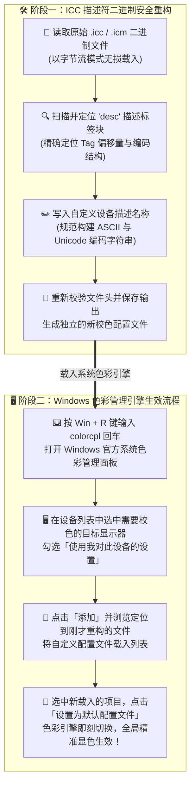

> **核心机制剖析：** Windows 11 在加载和显示色彩配置文件（`.icc` 或 `.icm`）时，读取的是文件内部的元数据描述（`desc` 标签），而不是文件系统中的文件名。直接重命名文件在系统色彩管理中依然显示旧名字。

---

## 📌 摄影与校色用户的真实困扰

作为摄影爱好者、设计从业者或多屏调色用户，为了确保色彩准确，我们通常会使用校色仪（如红蜘蛛 Datacolor Spyder、爱色丽 X-Rite / Calibrite）对屏幕进行精细校准。为了适应不同的光照环境，我们往往会生成多个配置文件，例如：

- `Dell-U2720Q-Day-120nit.icc`（白天明亮办公模式）
- `Dell-U2720Q-Night-80nit.icc`（夜间柔光修图模式）

然而，只要你使用的是 **Windows 11** 系统，就会遭遇一个非常令人抓狂的顽疾：

> **明明已经在文件资源管理器中把文件名改成了清晰易懂的名字，但按下快捷键打开系统“色彩管理 (colorcpl)”后，列表中依然顽固地显示着生成时的旧名字（例如一长串无意义的硬件代码 `CSO076D-6500-light` 或者出厂序列号）！**

### 为什么直接改文件名完全无效？

这是由 ICC 国际色彩联盟（International Color Consortium）的标准规范决定的。色彩配置文件内部有一张严格的二进制 **Tag 索引表**，Windows 色彩引擎在解析 ICC 文件时，直接定位读取的是内部名为 `desc`（TextDescriptionType）的数据块内容。

如果文件内部这个 `desc` 字符串没有被修改，无论你在 Windows 资源管理器里把文件名字改成什么花样，系统设置与控制面板中读取并显示的始终是旧名字！

手动用十六进制编辑器（如 010 Editor、Hex Fiend）修改极其危险：因为字符串长度一旦变化，必须同步重新计算 Tag 大小、校准全局偏移量并重新计算头部字节，稍有差错文件就会彻底损坏报废。

为了彻底解决这个痛点，我用 Node.js 编写了这个专门通过**底层二进制流重构** ICC 内部描述的极简工具 —— **Icc_Desc_Changer**。

---

## 🛠️ 环境准备

本工具基于原生 Node.js 编写，运行前只需确保电脑上安装有基础的 Node.js 运行时：

- **检查环境**：打开命令行终端（CMD 或 PowerShell），输入：
  ```bash
  node -v
  ```
- **安装建议**：如未安装，可直接前往 [Node.js 官网 (nodejs.org)](https://nodejs.org/) 下载并安装 LTS 长期支持版。

---

## 🚀 基础命令与实战示例

### 1. 基础命令语法

定位到工具目录后，在终端中执行以下命令格式：

```bash
node modify_icc_name.js <ICC文件路径> <新配置名称>
```

### 2. 实操演示：小新 Pro13 屏幕校色文件重构

若要将同目录下的联想小新 Pro13 校色文件 `CSO076D-6500-light.icc` 的内部描述修改为直观的 `小新Pro13-高亮6500K`，在终端执行：

```bash
node modify_icc_name.js ./CSO076D-6500-light.icc 小新Pro13-高亮6500K
```

### 3. 运行过程与安全备份机制

运行后，脚本会自动执行以下安全流程：

- **安全备份**：脚本会在同目录下自动生成一份 `.bak.icc` 备份文件（如 `CSO076D-6500-light.bak.icc`），即便误操作也可一秒还原；
- **二进制重写**：精准解析 Tag 表，在内存 Buffer 中重新对齐字节偏移并覆写；
- **终端输出日志**：
  ```text
  [备份] 原始文件已备份至: ./CSO076D-6500-light.bak.icc
  [成功] 已成功将内部配置名称修改为: "小新Pro13-高亮6500K"
  [成功] 输出路径: ./CSO076D-6500-light.icc
  ```

---

## 💻 如何在 Windows 11 中加载并生效（完整指南）

修改完成后，请按照以下标准步骤将新的校色文件载入系统色彩引擎：



1. **打开系统色彩管理**：  
   按下快捷键 <kbd>Win</kbd> + <kbd>R</kbd>，在运行窗口中输入 `colorcpl` 并回车；
2. **选择目标显示设备**：  
   在 **设备 (Devices)** 下拉菜单中，选中你需要应用校色配置的目标显示器；
3. **启用自定义选项**：  
   勾选上方的 **“使用我对此设备的设置” (Use my settings for this device)**；
4. **添加修改后的文件**：
   - 点击底部的 **添加 (Add...)** 按钮；
   - 点击左下角的 **浏览 (Browse...)**；
   - 找到并选中刚才重构完成的 `.icc` 文件；
5. **设置生效**：  
   在配置文件列表中选中刚才添加的项目（此时显示的正是你自定义的中文名！），点击 **“设置为默认配置文件 (Set as Default Profile)”**，屏幕瞬间切换至精准色彩模式！

---

## 🎁 仓库额外福利：校色文件说明

项目仓库内除了包含重构工具外，还贴心附赠了针对 **联想小新 Pro13**（包括 AUO2026 与 CSO076D 面板）经高精度仪器校正后的两份优质校色文件：

- `AUO2026-6500.icc`：针对友达 AUO 屏幕调教，D65 标准色温，伽马 2.2；
- `CSO076D-6500.icc`：针对华星光电 CSO 屏幕调教，校正原厂轻微偏暖绿现象，还原通透纯净的原色观感。

---

## 获取源码与项目地址

完整代码与校色文件已在 GitHub 开源：

👉 **GitHub 仓库**：[yudong2ao/Icc_Desc_Changer](https://github.com/yudong2ao/Icc_Desc_Changer)

```bash
git clone https://github.com/yudong2ao/Icc_Desc_Changer.git
```
