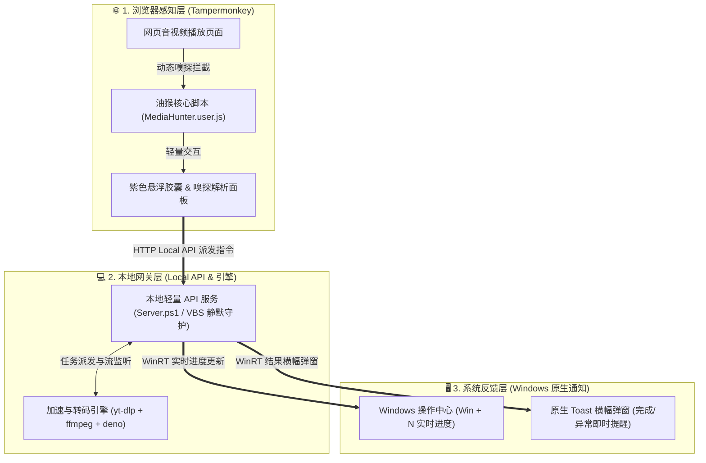

> **核心理念：** 拒绝臃肿的 GUI 客户端，拒绝浏览器的下载沙盒限制。让极客工具回归“静默、高效、安全、高度可配”的本质。

## 📌 项目背景与痛点

在日常查阅资料、技术学习或流媒体浏览时，我们经常需要将网页中的音视频资源离线保存下来。市面上常见的嗅探方案通常存在以下两难困境：

1. **纯浏览器扩展（插件）**：
   - 虽然“点击即下载”非常符合直觉，但受限于浏览器自身的**沙盒权限限制**，插件无法直接调用底层的原生多线程网络并发库；
   - 面对复杂的流媒体签名、m3u8 分片合成或 DRM/格式转换，浏览器往往束手无策，大文件还极易导致标签页无响应崩溃。
2. **独立桌面 GUI 下载器**：
   - 虽然底层集成了强大的下载引擎，但通常**体积庞大、常驻后台耗费数百兆内存**；
   - 复制网页链接、切换窗口、等待解析、选择清晰度的交互流程极其割裂，打碎原有的浏览心流体验。

**能不能兼得两者的优势——既保留浏览器插件“悬浮轻点”的丝滑，又拥有原生命令行下载引擎（yt-dlp + ffmpeg）的强悍性能与多线程能力，同时还不被丑陋常驻的界面打扰？**

带着这股极客执念，我设计并开发了 **MediaHunter（媒体猎手）**。

---

## 📸 运行效果演示 (Showcase)

以下是 MediaHunter 完整的工作流演示（悬浮按钮 ➔ 嗅探解析面板 ➔ 点击下载 ➔ 后台下载进度条 ➔ 提示下载完成）：


> **💡 交互体验设计原则：**
>
> - **零打扰弱提醒**：点击“下载”时，仅网页端悬浮胶囊状态微动变为“下载中”进行弱提醒，轻量不阻断浏览；
> - **按需查看进度**：可随时按下快捷键 <kbd>Win</kbd> + <kbd>N</kbd> 呼出 Windows 系统原生**通知中心**，查阅实时的下载进度条与速度；
> - **关键节点强提醒**：仅在**下载完成**或**下载失败**时，才会在桌面右下角弹出原生 Toast 横幅，点击即可直达保存目录。

---

## 🚀 架构设计：跳出沙盒的协同系统

MediaHunter 采用**“前端轻量感知 + 本地服务网关 + 原生系统通知”**的分布式微内核架构：



1. **前端（Tampermonkey 油猴脚本）**：负责拦截并提取网页流媒体网络请求，智能匹配音视频流、封装格式与清晰度选项，渲染低干扰悬浮控件；
2. **本地网关（Local API Server）**：在本地后台轻量静默运行（无任何命令行黑框常驻），接收前端分发的下载指令，调度 `yt-dlp`、`ffmpeg` 及 `deno` 引擎执行多线程并发加速；
3. **系统反馈（Windows 原生 Toast 通知）**：直接接入 Windows 10/11 系统的操作中心（Action Center），告别简陋的第三方通知弹窗。

---

## 🌟 核心特性对照

| 维度                 | 传统浏览器嗅探插件           | 独立桌面 GUI 下载软件      | **MediaHunter (媒体猎手)**                |
| :------------------- | :--------------------------- | :------------------------- | :---------------------------------------- |
| **内存与资源占用**   | 标签页内存叠加，大文件易卡死 | 200MB ~ 500MB (常驻多进程) | **< 15MB 静默运行，0 视觉干扰**           |
| **下载引擎与性能**   | 浏览器单线程 Fetch API       | 依赖内置定制引擎           | **原生 yt-dlp + 多线程并发 + ffmpeg**     |
| **流媒体合成与解密** | 格式支持有限，转码困难       | 支持良好                   | **内置 deno 解密引擎与全格式音视频合并**  |
| **交互与进度通知**   | 需频繁切换扩展气泡窗口       | 独立弹窗抢占焦点           | **Windows 原生通知中心 (Win+N 随叫随到)** |

---

## 📦 部署与快速上手指南

项目发布提供两种开箱即用包：

- **全能集成包 (`MediaHunter-Full.zip`)**：**推荐，开箱即用**。内置集成了 `yt-dlp.exe`、`ffmpeg.exe`/`ffprobe.exe` 以及免安装的解密引擎 `deno.exe`；
- **纯净轻量包 (`MediaHunter-Lite.zip`)**：**体积小**。仅包含核心网关脚本，自由复用系统已安装的全局环境。

---

### 第一步：启动本地静默网关

1. 下载解压 `MediaHunter-Full.zip` 至本地任意目录（例如 `D:\MediaHunter\`）；
2. 双击运行目录下的 **`StartServer.vbs`**，本地网关将以完全隐藏的窗口形式在后台启动就绪。

> [!WARNING] > **Windows 11 24H2 及以上系统的兼容性提示：**  
> 微软从 Windows 11 版本 24H2 (OS Build 26100 及以上) 开始默认将 VBScript 设为按需可选功能。如果您双击 `.vbs` 脚本无反应或报错，请前往 Windows **“设置” -> “系统” -> “可选功能”** 中搜索并安装 **“VBScript”**。

---

### 第二步：安装油猴脚本

1. 确保浏览器已安装 [Tampermonkey (油猴)](https://www.tampermonkey.net/) 插件；
2. 在油猴仪表盘中点击“添加新脚本”，导入项目中的 `MediaHunter.user.js` 代码并保存；
3. 刷新任意视频网站，页面右下角将呈现紫色的 **「媒体猎手」** 悬浮按钮，点击即可呼出嗅探面板一键极速下载！

---

## ⚙️ 核心配置调优指南

在解压目录中的 `yt-dlp.conf` 与 `Server.ps1` 内，提供了丰富的极客调优项：

- **并发下载线程**：支持自由指定 `--concurrent-fragments` 加速流媒体分片拉取；
- **代理支持**：无缝配置全局 HTTP/SOCKS5 代理端口，海外流媒体秒速拉取；
- **存储路径**：默认保存至系统的“下载 (Downloads)”目录，支持在配置中灵活指定专属媒体库分区。

---

## 🛠️ 常见问题与日志诊断 (FAQ)

- **Q：网页端点击下载后提示无法连接本地网关？**  
  A：请检查 `StartServer.vbs` 是否已运行。可在任务管理器中查看是否存在 `powershell.exe` 正在监听默认的本地回环接口（`127.0.0.1`）。
- **Q：为什么没有弹出下载进度？**  
  A：MediaHunter 遵循“弱提醒”原则，下载中请按 <kbd>Win</kbd> + <kbd>N</kbd> 在系统通知中心查看；只有下载完成或失败时才会主动弹出横幅。

---

## 获取源码与项目地址

完整项目源码、脚本与 Releases 安装包已在 GitHub 开源，欢迎体验与贡献：

👉 **GitHub 仓库**：[yudong2ao/MediaHunter](https://github.com/yudong2ao/MediaHunter)

```bash
git clone https://github.com/yudong2ao/MediaHunter.git
```
