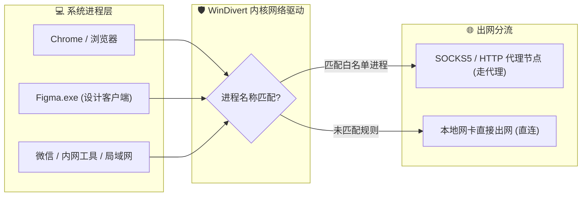

> **ProxyBridge** 是一款 Windows 进程级透明代理与流量分流增强包。它可以让指定软件（如 Chrome、特定游戏或开发工具）的网络流量自动走代理，无需在软件内部单独配置。

---

## 📌 痛点背景：为什么需要进程级分流？

在日常使用 Windows 进行开发、游戏或网络访问时，很多朋友都经历过这样的两难场景：

1. **全局代理 / TUN 虚拟网卡模式**：
   - 虽然省事，但属于“一刀切”方案。局域网打印机、企业内网通讯工具、微信、百度网盘或大型游戏等不希望走代理的流量，经常会被强制绕行；
   - 不仅无谓消耗宝贵的代理流量，更可能导致企业内网权限验证失败或局域网共享瘫痪；
2. **软件内部手动配置代理**：
   - 很多命令行工具（如特定 CLI）、老旧单机联机游戏、特定桌面客户端根本**没有提供任何代理设置界面**；
   - 传统通过修改注册表或设置环境变量的方法繁琐易遗漏，且经常在软件更新后失效。

**ProxyBridge** 是开源社区一款非常出色的、基于 WinDivert 底层驱动开发的进程级透明代理工具。不过官方 CLI 版本通常需要手动在终端中通过命令行运行，且规则文件编写门槛较高。

为了让日常使用体验更顺畅，我基于官方核心组件制作了这个**增强懒人包 —— ProxyBridge_CLI_Plus**，补全了可视化网页配置与后台静默自启的关键交互拼图。

---

## ✨ 亮点特色

- 🎯 **纯粹的进程级精准分流**：按软件程序名（如 `chrome.exe`、`Figma.exe`、`git.exe`）自由指定哪些流量走代理、哪些直连，简单高效；
- 🖥️ **网页可视化配置 (`ProfileMake.html`)**：双击网页即可图形化编辑节点与规则，支持直接在网页上浏览选择本地 `.exe` 程序追加到分流列表中，导出即用；
- ⚡ **开机后台静默自启 (`一键配置自启.bat`)**：一键将服务挂载为系统后台静默任务，开机即用，零命令行黑框弹窗打扰；
- 🔄 **无缝升级**：完全兼容官方配置文件标准格式，后续官方核心更新时，直接替换同名 `.exe` 或 `.dll` 即可平滑升级。

---

## 🚀 流量分流拓扑与架构



---

## 📂 项目组成结构

增强包开箱即用，内置完整的核心驱动组件与配套交互工具：

```text
ProxyBridge/
├── ProfileMake.html       # 网页版配置文件生成器 (双击打开即可可视化编辑)
├── 一键配置自启.bat       # 开机静默自启一键配置脚本
├── Default.pbprofile      # 默认配置文件 (规则与节点参数)
├── ProxyBridge_CLI.exe    # 核心运行程序
├── ProxyBridgeCore.dll   # 核心动态链接库
├── WinDivert.dll          # 底层网络驱动接口库
└── WinDivert64.sys        # Windows 64位底层网络驱动
```

---

## 🚀 完整使用说明指南

### 1. 可视化修改配置

1. 用任意浏览器双击打开目录下的 **`ProfileMake.html`**；
2. 在网页界面中填写你的本地代理监听地址（例如 `127.0.0.1:7890`）；
3. 在分流规则面板中，点击“添加规则”，直接选择目标 `.exe` 文件（或手动键入程序名）；
4. 点击“生成并导出配置”，将下载的文件重命名覆盖同目录下的 `Default.pbprofile`。

### 2. 运行与后台静默常驻

- **开机自启（推荐）**：  
  右键以管理员身份运行 **`一键配置自启.bat`**。脚本会自动将后台静默服务挂载至 Windows 任务中，以后每次开机即可无感静默享受分流。
- **临时命令行调试**：  
  以管理员身份打开 CMD 或 PowerShell，输入：
  ```bash
  ProxyBridge_CLI.exe --profile "Default.pbprofile"
  ```

---

## 🤝 致谢与关于

本项目**基于官方开源项目 ProxyBridge** 提取了核心运行组件，并配套设计了可视化配置生成器与一键静默自启脚本，旨在提供更便携的使用体验。

在此特别感谢官方 **ProxyBridge** 项目及开源社区贡献者提供的卓越网络底层能力！

---

## 获取源码与项目地址

增强包完整工程已在 GitHub 开源：

👉 **GitHub 仓库**：[yudong2ao/ProxyBridge_CLI_Plus](https://github.com/yudong2ao/ProxyBridge_CLI_Plus)

```bash
git clone https://github.com/yudong2ao/ProxyBridge_CLI_Plus.git
```
