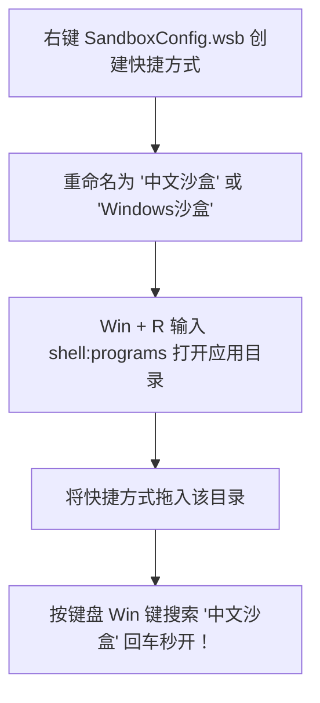

> **SandboxConfig** 是一个轻量级的 Windows 沙盒 (`.wsb`) 配置文件。它的主要作用是在每次启动 Windows 沙盒时，自动在后台运行脚本，将沙盒系统的显示语言和输入法强制设置为**简体中文 (zh-CN)**。

---

## 📌 痛点背景：为什么需要中文环境配置？

**Windows 沙盒 (Windows Sandbox)** 是微软自 Windows 10 起引入的一项堪称“神器”的轻量级虚拟化利器。与笨重的 VMware 或 VirtualBox 相比，它拥有秒级极速拉起、资源占用极低、以及“关闭即彻底焚毁”的纯净特性，是测试陌生开源脚本、分析未知可疑软件或进行免污染测试的绝佳环境。

然而，凡是经常使用沙盒的朋友，几乎都经历过下面这个极为繁琐的痛点：

> **由于沙盒的底层机制是“每次启动都会完全重置为一个全新的纯净初始环境”，系统默认经常呈现为全英文界面，且根本没有预装微软拼音中文输入法！**

每次为了测试一个小工具，刚进沙盒桌面就得先去 Windows 设置里翻找区域与语言选项、添加中文语言包、漫长等待输入法组件初始化。这让原本应当“即开即测”的轻快体验大打折扣。

---

## ⚙️ 前置要求与环境准备

在使用本配置文件前，请确认你的系统环境满足以下条件：

- **系统版本**：Windows 10 或 Windows 11（需要是专业版、企业版或教育版；家庭版系统由于微软限制不支持 Windows Sandbox 功能）；
- **开启系统功能**：按下快捷键 <kbd>Win</kbd> + <kbd>R</kbd> 输入 `optionalfeatures`，在弹出的“启用或关闭 Windows 功能”列表中，勾选并安装 **“Windows 沙盒”**，按提示重启系统即可。

---

## 🚀 核心指令解析：一行命令重塑系统语言

Windows 沙盒本身提供了基于标准 XML 语法的 `.wsb`（Windows Sandbox Configuration）文件支持。借助 `<LogonCommand>` 节点，可以让沙盒在用户进入桌面的第一时刻自动执行指定系统指令。

为了避免繁琐的联网下载等待，我调用 PowerShell 原生的语言列表接口，在 `SandboxConfig.wsb` 中配置了这行紧凑高效的指令：

```xml
<Configuration>
  <LogonCommand>
    <Command>powershell -command "$languageList=New-WinUserLanguageList zh-CN;Set-WinUserLanguageList $languageList -Force"</Command>
  </LogonCommand>
</Configuration>
```

### 执行逻辑剖析：

1. `New-WinUserLanguageList zh-CN`：在内存中即时构建包含简体中文语言、区域格式及微软拼音输入法的语言配置对象；
2. `Set-WinUserLanguageList ... -Force`：以静默且强制的方式，瞬间将沙盒当前用户会话的语言首选项重写为该列表，无需交互确认。

进入桌面后仅需毫秒级后台处理，即可瞬间呈现熟悉的中文桌面与拼音输入法。

---

## 🚀 基础使用方法

1. 下载本项目中的 `SandboxConfig.wsb` 文件保存到电脑上的固定目录（例如 `D:\Tools\`）；
2. 以后无需打开系统默认的沙盒应用，直接**双击**该 `.wsb` 文件；
3. Windows 沙盒会自动启动，并在进入桌面后自动执行后台脚本，直接呈现中文环境！

---

## 💡 进阶技巧：添加到“开始菜单”实现随叫随到

为了像普通原生软件一样随时召唤沙盒，推荐将该配置文件直接接入 Windows 开始菜单：



1. **创建快捷方式**：找到下载好的 `SandboxConfig.wsb` 文件，右键点击选择“创建快捷方式”；
2. **重命名**：将生成的快捷方式重命名为你习惯的名字，例如：**`中文沙盒`** 或 **`Windows沙盒`**；
3. **打开系统程序目录**：按下键盘上的快捷键 <kbd>Win</kbd> + <kbd>R</kbd> 打开“运行”窗口，输入：
   ```text
   shell:programs
   ```
   回车即可直接打开当前用户的开始菜单程序目录；
4. **放入快捷方式**：将刚才重命名好的快捷方式直接拖入或复制到该文件夹中；
5. **极客体验**：现在，无论你在进行什么操作，只需随手轻按键盘上的 <kbd>Win</kbd> 键，输入“中文沙盒”并回车，带有中文输入法的纯净沙盒即刻秒开！

---

## 获取源码与项目地址

配置文件已在 GitHub 开源：

👉 **GitHub 仓库**：[yudong2ao/SandboxConfig](https://github.com/yudong2ao/SandboxConfig)

```bash
git clone https://github.com/yudong2ao/SandboxConfig.git
```
